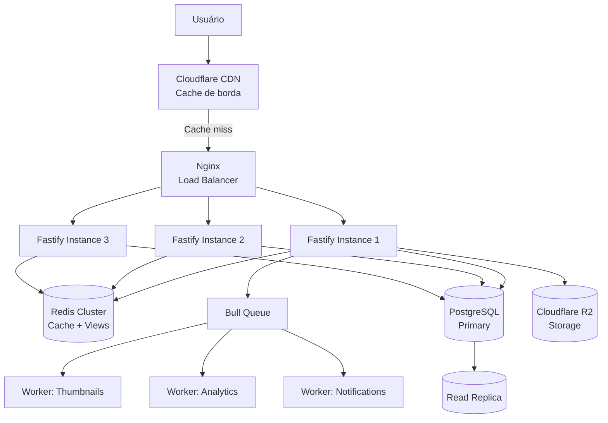

# 📈 Escalabilidade — Portal NTB

> Guia prático para escalar o Portal NTB de 1k a 1M de usuários/dia.

---

## Cenários de Tráfego

| Cenário | Usuários/dia | Pageviews/dia | Req/s (pico) | VPS recomendado | Custo/mês |
|:-------:|:------------:|:-------------:|:------------:|:---------------:|:---------:|
| 🏁 **Início** | ~1.000 | ~8.000 | ~0,3 | 1 vCPU, 2GB RAM | **~$15-25** |
| 🟢 **Crescendo** | ~20.000 | ~160.000 | ~6,7 | 2 vCPU, 4GB RAM | **~$30-50** |
| 🟡 **Sucesso** | ~50.000 | ~400.000 | ~16,7 | 4 vCPU, 8GB RAM | **~$80-130** |
| 🟠 **Grande** | ~100.000 | ~800.000 | ~33 | 4 vCPU, 8GB + Redis | **~$130-200** |
| 🔴 **Massivo** | ~500.000 | ~4.000.000 | ~167 | Cluster multi-região | **~$500+** |

---

## 🏁 Início — Até 1k usuários/dia

**Não precisa de nada.** O setup atual aguenta.

- Docker Compose padrão (backend + frontend + PostgreSQL)
- Cloudflare R2 para imagens (já configurado)
- Nginx com HTTPS

---

## 🟢 20k usuários/dia — ~2h de ajustes

**O que fazer:**
1. Aumentar rate limit de 100 → 500 req/min (`backend/src/app.ts`)
2. Substituir `Map` por `lru-cache` para views (`backend/src/controllers/news.controller.ts`)
3. Aumentar pool do Prisma para 20 conexões (`DATABASE_URL?connection_limit=20`)
4. Criar índice composto `(portal_id, status, published_at DESC)`

**Resultado:** TTFB ~200ms, sem erros, ~30% CPU no pico.

---

## 🟡 50k usuários/dia — ~5h de trabalho

**Tudo acima + Redis.**

### Por quê?
Com 50k/dia, o PostgreSQL começa a sentir. Cada página pública faz ~6 queries. Sem cache, são ~6.000 queries/min no pico.

### O que fazer:
1. ✅ Tudo do cenário de 20k
2. **Adicionar Redis** — cachear queries públicas com TTL de 30-60s
3. **Pool de 50 conexões** no Prisma
4. **Cache de views no Redis** (em vez de Map/lru-cache)
5. **Cloudflare CDN** (plano Free) na frente do site — cache de borda

### Arquivos para alterar:
| Arquivo | O que fazer |
|---------|-------------|
| `backend/package.json` | `npm install ioredis lru-cache` |
| `backend/src/config/redis.ts` | **Criar** — conexão Redis |
| `backend/src/config/env.ts` | Adicionar `REDIS_HOST`, `REDIS_PORT`, `REDIS_PASSWORD` |
| `backend/src/repositories/news.repository.ts` | Cachear `findPublished()`, `findFeatured()`, `findBreaking()` |
| `backend/src/repositories/category.repository.ts` | Cachear `findMany()` |
| `backend/src/services/banner.service.ts` | Cachear `getActive()` |
| `backend/src/controllers/news.controller.ts` | Views via Redis ou lru-cache |
| `docker-compose.prod.yml` | Adicionar serviço `redis` |
| `backend/.env.example` | Adicionar variáveis Redis |
| `nginx.conf` | Adicionar compressão Brotli |
| Cloudflare Dashboard | Ativar cache + minify + Brotli |

### Resultado:
- **-80% queries no PostgreSQL** (~1.200/min vs ~6.000/min)
- **TTFB < 50ms** na homepage (cache Redis + ISR)
- **Zero erros** 429, pool ou OOM
- **CPU < 30%** no pico

### Custo adicional:
| Recurso | Custo/mês |
|---------|:---------:|
| Redis (dentro do VPS) | $0 (já incluso) |
| Redis gerenciado (Upstash/Redis Labs) | ~$10-15 |
| Cloudflare CDN | Grátis |
| **Total adicional** | **~$10-15/mês** |

---

## 🟠 100k usuários/dia — ~7h de trabalho

**Tudo acima + multi-instância.**

### O que fazer:
1. ✅ Tudo do cenário de 50k
2. **2-3 instâncias do backend** (`docker-compose.prod.yml` com `deploy.replicas=3`)
3. **pgBouncer** para pool de conexões do PostgreSQL
4. **Cluster mode no Node** (opcional — múltiplos workers por instância)
5. **Cloudflare Page Rules** — cache de HTML por 1h

### Gargalo que aparece:
- Node.js single-thread → precisa de múltiplas instâncias para usar >1 core
- PostgreSQL connection pool → pgBouncer gerencia melhor que o pool nativo
- Disco/EBS → PostgreSQL precisa de SSD com IOPS provisionados

### Infra recomendada:
```
LB (Cloudflare) → Nginx → 3× backend (Fastify)
                                     ↓
                              Redis Cluster
                                     ↓
                         PostgreSQL (2 vCPU, 8GB RAM)
```

---

## 🔴 500k+ usuários/dia — Arquitetura Enterprise

**Tudo acima + cluster + filas + read replicas.**

### O que fazer:
1. ✅ Tudo do cenário de 100k
2. **Read replicas do PostgreSQL** — queries de leitura vão para as réplicas
3. **Filas de jobs** (Bull + Redis) — tarefas pesadas (thumbnails, analytics)
4. **Multi-região** — Cloudflare + backend em múltiplas regiões
5. **CDN com cache de borda avançado** — Cloudflare Enterprise ou CloudFront
6. **Monitoramento full** — Grafana + Prometheus + alertas
7. **Auto-scaling** — Kubernetes ou Nomad

### Infra recomendada:
```
Cloudflare (Global LB) → us-east → Nginx → 5× backend → Redis → PG Primary
                                                  ↘           ↙
                                               Bull Queue → Workers
                           → eu-west → Nginx → 3× backend → Redis → PG Replica
```

---

## Checklist Prático

### 🟢 Antes de abrir (1h)
- [ ] Rate limit: 500 req/min
- [ ] Pool do Prisma: 20+ conexões
- [ ] Índice composto `(portal_id, status, published_at DESC)`
- [ ] lru-cache para views
- [ ] Cloudflare na frente do site

### 🟡 Antes de 50k/dia (3h)
- [ ] Redis instalado e configurado
- [ ] Cache de queries públicas (30-60s TTL)
- [ ] Cloudflare cache de borda ativado
- [ ] Compressão Brotli no Nginx
- [ ] Monitoramento básico (uptime + CPU + RAM)

### 🟠 Antes de 100k/dia (2h)
- [ ] Múltiplas instâncias do backend
- [ ] pgBouncer
- [ ] Cloudflare Page Rules (cache HTML)
- [ ] Alertas configurados

### 🔴 500k+ (sob demanda)
- [ ] Read replicas PostgreSQL
- [ ] Filas de jobs (Bull + Redis)
- [ ] Kubernetes / Nomad
- [ ] Multi-região
- [ ] Monitoramento full (Grafana + Prometheus)

---

## Arquitetura Final (100k+)



---

## Custos Referência (Jul/2026)

| Provedor | 20k/dia | 50k/dia | 100k/dia |
|----------|:-------:|:-------:|:--------:|
| **DigitalOcean** | ~$24 | ~$84 | ~$168 |
| **Hetzner** (Cloud) | ~$12 | ~$40 | ~$80 |
| **AWS EC2** (on-demand) | ~$40 | ~$120 | ~$240 |
| **Oracle Cloud** (free tier) | $0 | — | — |

> **Recomendação:** Hetzner CX42 (4 vCPU, 8GB RAM) por ~$40/mês + Cloudflare Free + Redis no mesmo servidor = ~$40-50/mês para 50k/dia.

---

## Referências

- [`/backend/src/config/redis.ts`](backend/src/config/redis.ts) — Configuração Redis
- [`docker-compose.prod.yml`](docker-compose.prod.yml) — Docker Compose produção
- [`nginx.conf`](nginx.conf) — Nginx com Brotli e proxy reverso
- [`.claude/planos/plano-execucao.md`](.claude/planos/plano-execucao.md) — Plano de execução detalhado
