# Portal NTB — CMS Multi-Tenant para Portais de Notícias

Portal NTB é um **CMS de notícias SaaS** desenvolvido para atender múltiplos portais de notícias a partir de uma única base de código. Combina as melhores práticas de arquitetura de software moderna com ferramentas de ponta para oferecer performance, escalabilidade e facilidade de manutenção.

> **Status:** Em desenvolvimento ativo — v1.0.0-beta

---

## 📋 Sumário

- [1. Visão Geral](#1-visão-geral)
- [2. Arquitetura](#2-arquitetura)
- [3. Stack Tecnológica](#3-stack-tecnológica)
- [4. Estrutura de Pastas](#4-estrutura-de-pastas)
- [5. Organização por Módulos](#5-organização-por-módulos)
- [6. Fluxo de Requisição](#6-fluxo-de-requisição)
- [7. Fluxo de Autenticação](#7-fluxo-de-autenticação)
- [8. Fluxo de Upload](#8-fluxo-de-upload)
- [9. Banco de Dados](#9-banco-de-dados)
- [10. Regras de Negócio](#10-regras-de-negócio)
- [11. Permissões (RBAC)](#11-permissões-rbac)
- [12. Workflow Editorial](#12-workflow-editorial)
- [13. SEO](#13-seo)
- [14. Multiportal (Multi-Tenancy)](#14-multiportal-multi-tenancy)
- [15. API](#15-api)
- [16. Segurança](#16-segurança)
- [17. Performance](#17-performance)
- [18. Escalabilidade](#18-escalabilidade)
- [19. Convenções](#19-convenções)
- [20. Boas Práticas](#20-boas-práticas)
- [21. Roadmap](#21-roadmap)
- [22. Decisões Arquiteturais (ADR)](#22-decisões-arquiteturais-adr)
- [23. Começando](#23-começando)
- [24. Contribuição](#24-contribuição)

---

## 1. Visão Geral

### O Problema

Portais de notícias regionais e locais enfrentam desafios comuns:

- **Custo proibitivo** de desenvolvimento de plataformas proprietárias
- **Manutenção complexa** de sistemas legados
- **Dificuldade em escalar** conteúdo entre diferentes audiências
- **SEO deficiente** que impacta o ranqueamento orgânico
- **Falta de ferramentas** para jornalistas e editores
- **Sistemas monolíticos** que dificultam evolução

### A Solução

Portal NTB é um CMS especializado que oferece:

- **Multi-tenant nativo** — um único deploy atende N portais
- **Workflow editorial** completo — do rascunho à publicação
- **SEO de fábrica** — meta tags, Open Graph, JSON-LD, sitemap, RSS
- **Upload otimizado** — imagens vão direto pro CDN sem passar pelo servidor
- **Painel administrativo** intuitivo para equipes de redação
- **API REST** documentada para integrações

### Objetivos Arquiteturais

| Princípio | Descrição |
|---|---|
| **Separação de responsabilidades** | Camadas bem definidas (controller → service → repository) |
| **Testabilidade** | Injeção de dependência e interfaces para mocking |
| **Portabilidade de storage** | `StorageProvider` abstrato — troque R2 por S3 sem alterar regras de negócio |
| **Segurança por design** | Validação em todas as camadas, sanitização HTML, prepared statements |
| **Escalabilidade horizontal** | Stateless API, SSR/ISR no frontend, cache em todas as camadas |
| **Multi-tenant isolado** | Dados segregados por `portalId` com índices compostos |

### Casos de Uso

- ✅ Jornalista cria rascunho de notícia → Editor revisa → Admin publica
- ✅ Upload de imagens com preview imediato e CDN
- ✅ SEO automático com Open Graph, Twitter Cards e JSON-LD
- ✅ Banner de anúncio 728x90 gerenciável pelo admin
- ✅ Feed RSS e sitemap.xml gerados automaticamente
- ✅ Busca full-text em notícias publicadas
- ✅ Múltiplos portais com dados, usuários e configurações isolados

---

## 2. Arquitetura

### Arquitetura em Camadas

O sistema segue uma arquitetura em camadas com separação clara de responsabilidades:

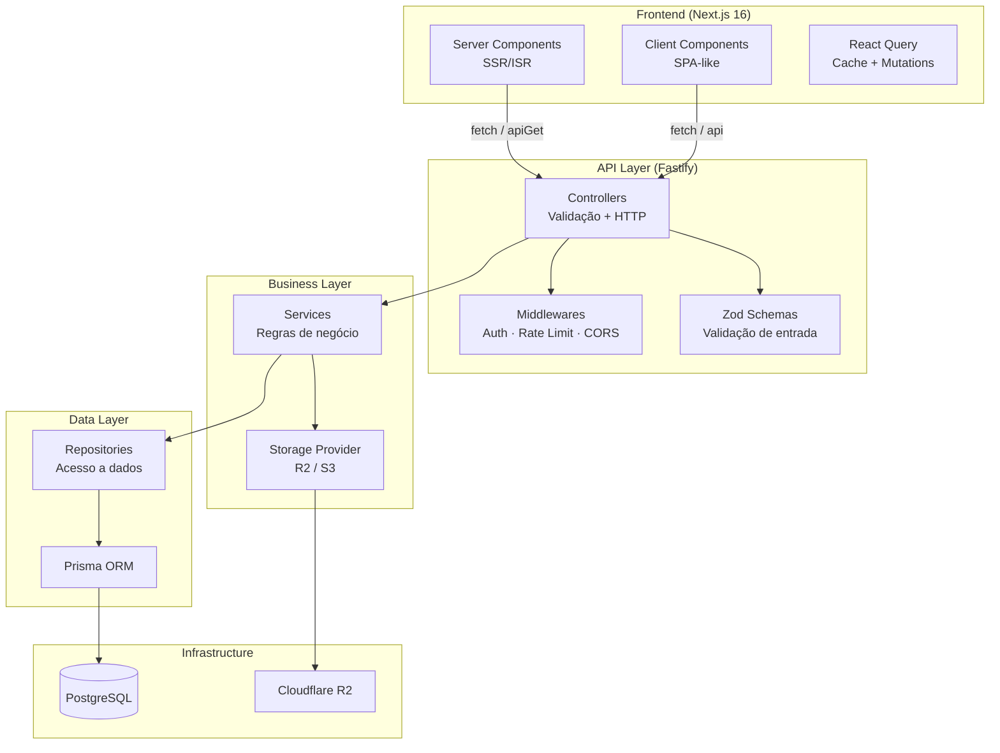

### Fluxo HTTP Completo

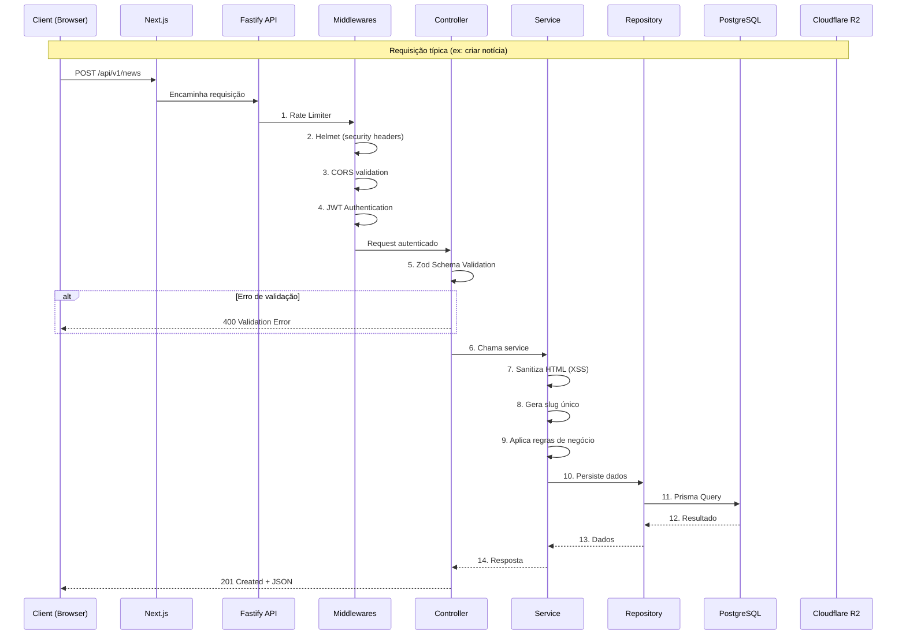

### Fluxo de Autenticação

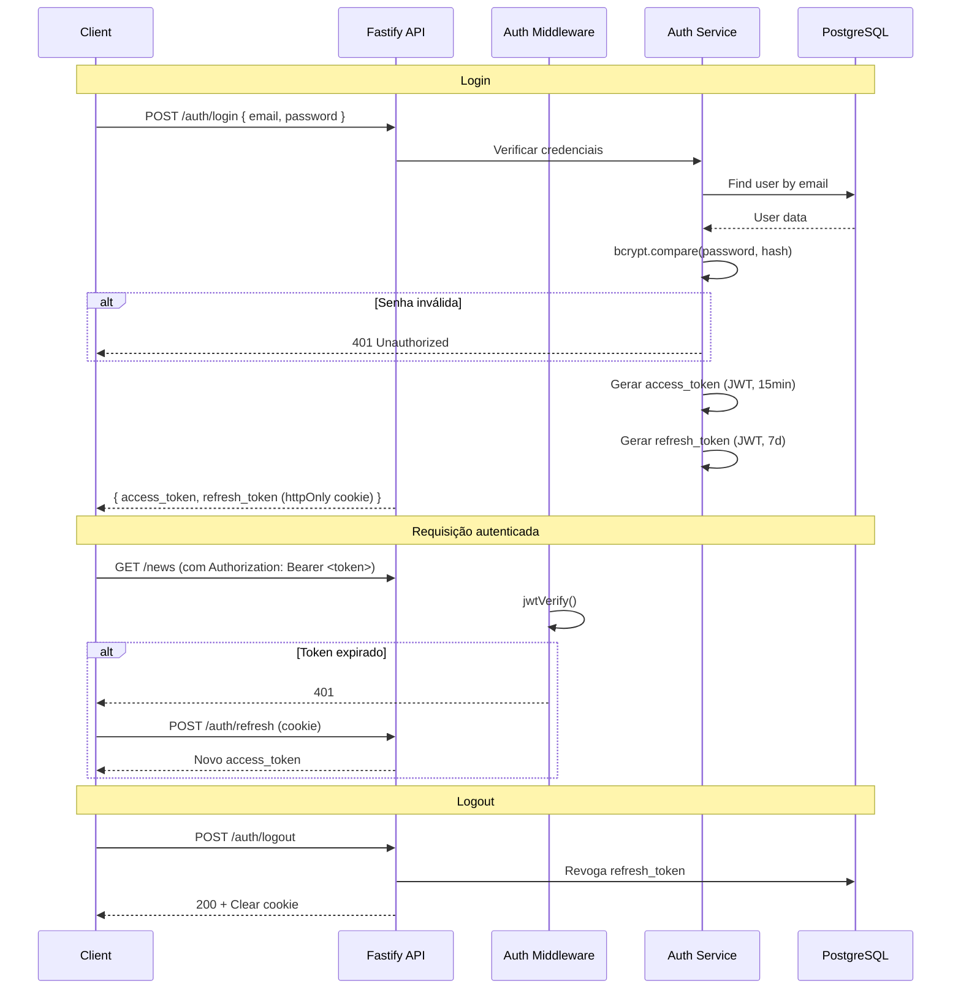

### Fluxo de Upload

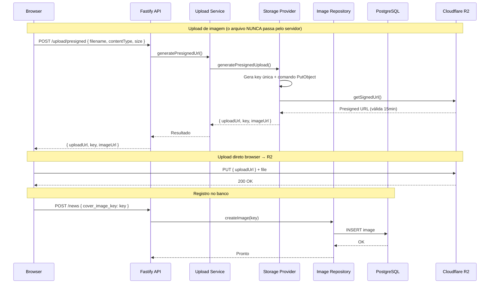

### Comunicação Frontend ↔ Backend

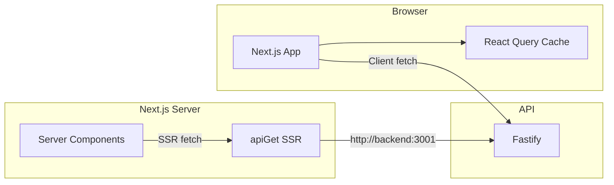

### Multi-Tenancy

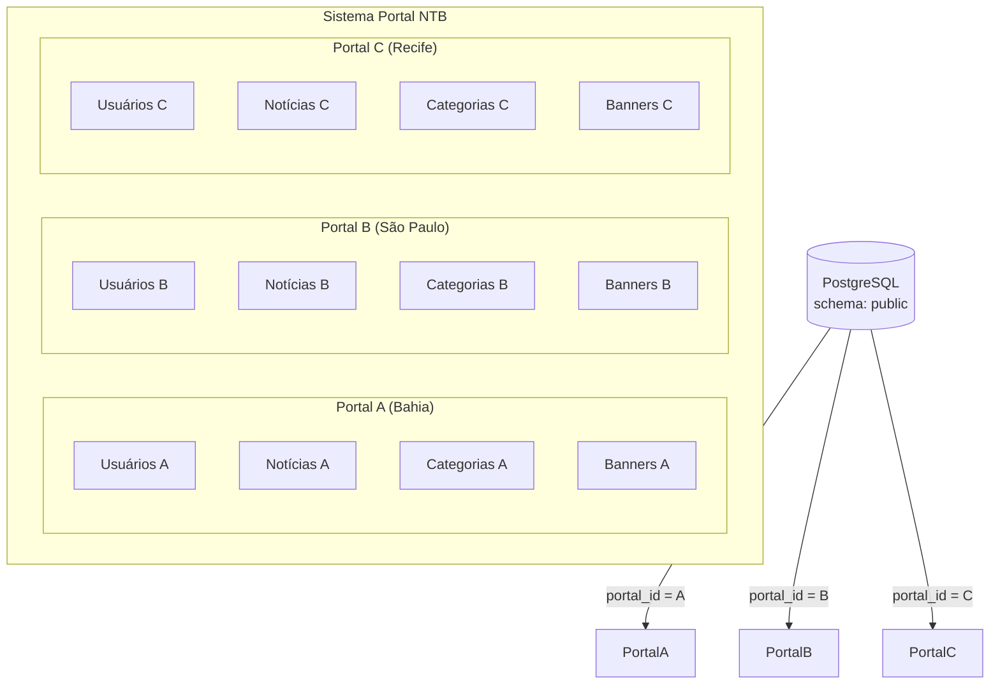

---

## 3. Stack Tecnológica

### Backend

| Tecnologia | Versão | Propósito | Motivo |
|---|---|---|---|
| **Node.js** | 22.x | Runtime | ESM nativo, performance, ecossistema |
| **Fastify** | 5.x | Framework HTTP | 2× mais rápido que Express, schema-based, plugins |
| **TypeScript** | 5.x | Tipagem | Type safety, autocomplete, documentação viva |
| **Prisma** | 5.x | ORM | Type-safe queries, migrations automáticas, studio |
| **PostgreSQL** | 16 | Banco de dados | Robustez, índices, JSONB, confiabilidade |
| **Zod** | 3.x (back) / 4.x (front) | Validação | Tipos inferidos automaticamente, mensagens em PT-BR |
| **JWT** | — | Autenticação | Stateless, padrão da indústria |
| **AWS SDK S3** | 3.x | Cloudflare R2 | Compatível com S3, presigned URLs |
| **Pino** | — | Logging | JSON-structured, baixíssimo overhead |

### Frontend

| Tecnologia | Versão | Propósito | Motivo |
|---|---|---|---|
| **Next.js** | 16.2 | Framework | SSR/ISR/SSG, App Router, Image Optimization |
| **React** | 19 | UI | Server Components, Concurrent Features |
| **Tailwind CSS** | v4 | Estilização | Utility-first, zero runtime, purga automática |
| **TanStack Query** | 5.x | Server state | Cache, refetch, mutations, devtools |
| **React Hook Form** | 7.x | Formulários | Performance, controlled/uncontrolled |
| **TipTap** | 3.x | Rich text editor | ProseMirror-based, extensível, headless |
| **Framer Motion** | 12.x | Animações | Layout animations, gestures, performance |
| **Lucide React** | — | Ícones | Leve, consistente, tree-shakeable |

### Infraestrutura

| Tecnologia | Propósito |
|---|---|
| **Docker Compose** | Orquestração local |
| **Cloudflare R2** | Storage de imagens (CDN + S3-compatible) |
| **PostgreSQL 16** | Banco de dados relacional |

---

## 4. Estrutura de Pastas

```
appnews/
├── backend/
│   ├── prisma/
│   │   ├── schema.prisma          # Modelo de dados (fonte da verdade)
│   │   ├── migrations/            # Migrations versionadas
│   │   ├── seed.ts                # Dados de desenvolvimento
│   │   └── types/                 # Tipos inferidos do Prisma
│   └── src/
│       ├── config/
│       │   ├── env.ts             # Validação de variáveis de ambiente (Zod)
│       │   ├── database.ts        # Singleton do Prisma Client
│       │   ├── cors.ts            # Configuração CORS
│       │   └── jwt.ts             # Configuração JWT
│       ├── controllers/           # Handlers HTTP (slim)
│       │   ├── auth.controller.ts
│       │   ├── news.controller.ts
│       │   ├── category.controller.ts
│       │   ├── tag.controller.ts
│       │   ├── upload.controller.ts
│       │   ├── user.controller.ts
│       │   ├── portal.controller.ts
│       │   ├── banner.controller.ts
│       │   └── seo.controller.ts
│       ├── services/              # Lógica de negócio
│       │   ├── auth.service.ts
│       │   ├── news.service.ts
│       │   ├── category.service.ts
│       │   ├── tag.service.ts
│       │   ├── upload.service.ts
│       │   ├── user.service.ts
│       │   ├── portal.service.ts
│       │   ├── banner.service.ts
│       │   └── storage/
│       │       ├── index.ts
│       │       └── storage-provider.ts   # Abstração R2/S3
│       ├── repositories/          # Acesso a dados (Prisma)
│       │   ├── news.repository.ts
│       │   ├── category.repository.ts
│       │   ├── tag.repository.ts
│       │   ├── user.repository.ts
│       │   ├── image.repository.ts
│       │   └── portal.repository.ts
│       ├── middlewares/
│       │   ├── auth.middleware.ts  # JWT + RBAC
│       │   └── error.middleware.ts # Error handler global
│       ├── routes/                 # Definição de rotas Fastify
│       │   ├── auth.routes.ts
│       │   ├── news.routes.ts
│       │   ├── category.routes.ts
│       │   ├── tag.routes.ts
│       │   ├── upload.routes.ts
│       │   ├── user.routes.ts
│       │   ├── portal.routes.ts
│       │   ├── banner.routes.ts
│       │   └── seo.routes.ts
│       ├── schemas/                # Validação Zod
│       │   ├── auth.schema.ts
│       │   ├── news.schema.ts
│       │   ├── category.schema.ts
│       │   ├── tag.schema.ts
│       │   ├── upload.schema.ts
│       │   └── user.schema.ts
│       ├── types/                  # Interfaces TypeScript
│       │   ├── api.ts
│       │   ├── jwt.ts
│       │   └── repositories.ts
│       └── utils/
│           ├── error.ts           # Erros customizados + sendSuccess
│           ├── hash.ts            # bcrypt wrappers
│           ├── slug.ts            # Geração de slugs
│           └── request-guard.ts   # requireAuth helper
├── frontend/
│   ├── src/
│   │   ├── app/
│   │   │   ├── (public)/          # Site público (SSR + ISR)
│   │   │   │   ├── page.tsx       # Homepage
│   │   │   │   ├── layout.tsx     # Layout público
│   │   │   │   ├── noticias/[slug]/page.tsx
│   │   │   │   ├── categorias/[slug]/page.tsx
│   │   │   │   ├── tags/[slug]/page.tsx
│   │   │   │   ├── busca/page.tsx
│   │   │   │   ├── rss/route.ts
│   │   │   │   ├── sitemap.xml/route.ts
│   │   │   │   └── hero-section.tsx
│   │   │   ├── (admin)/           # Painel admin
│   │   │   │   ├── dashboard/page.tsx
│   │   │   │   ├── noticias/page.tsx
│   │   │   │   ├── noticias/novo/page.tsx
│   │   │   │   ├── noticias/[slug]/edit/page.tsx
│   │   │   │   ├── categorias/page.tsx
│   │   │   │   ├── tags/page.tsx
│   │   │   │   ├── usuarios/page.tsx
│   │   │   │   ├── uploads/page.tsx
│   │   │   │   ├── banner/page.tsx
│   │   │   │   ├── configuracoes/page.tsx
│   │   │   │   ├── perfil/page.tsx
│   │   │   │   └── layout.tsx
│   │   │   ├── login/page.tsx
│   │   │   ├── api/               # API routes
│   │   │   ├── layout.tsx         # Root layout
│   │   │   ├── providers.tsx      # React Query + Auth providers
│   │   │   └── globals.css
│   │   ├── components/
│   │   │   ├── ui/                # shadcn/ui components
│   │   │   ├── layouts/           # Header, Footer, AdminLayout
│   │   │   ├── news/              # NewsForm, NewsCard, NewsGrid
│   │   │   └── admin/             # Admin-specific components
│   │   ├── hooks/                 # React Query hooks
│   │   ├── lib/                   # API client, auth, utils, image
│   │   └── types/                 # TypeScript types
│   └── next.config.ts
├── docker-compose.yml
├── docker-compose.dev.yml
└── docker-compose.prod.yml
```

---

## 5. Organização por Módulos

### 📦 Módulo Auth

**Responsabilidade:** Autenticação e autorização de usuários.

**Endpoints:**

| Método | Rota | Descrição | Acesso |
|---|---|---|---|
| POST | `/auth/login` | Login com email + senha | Público |
| POST | `/auth/refresh` | Renovar access token | Refresh Cookie |
| POST | `/auth/logout` | Revogar refresh token | JWT |
| GET | `/auth/me` | Dados do usuário logado | JWT |

**Regras:**
- Senhas armazenadas com bcrypt (12 rounds)
- Access token: JWT com 15 minutos de expiração
- Refresh token: JWT com 7 dias, armazenado em httpOnly cookie
- Refresh token é revogado no logout (blacklist no banco)
- Ao renovar, o refresh token antigo é revogado (rotation)

**Dependências:** UserService, UserRepository

**Entidades:** User, Session, RefreshToken

---

### 📦 Módulo News

**Responsabilidade:** CRUD completo de notícias com workflow editorial.

**Endpoints:**

| Método | Rota | Descrição | Acesso |
|---|---|---|---|
| GET | `/news` | Listar notícias (com filtros) | Público/Auth |
| GET | `/news/:slug` | Detalhes da notícia | Público |
| POST | `/news` | Criar notícia | JWT |
| PUT | `/news/:id` | Atualizar notícia | JWT |
| PATCH | `/news/:id/publish` | Publicar notícia | Editor/Admin |
| PATCH | `/news/:id/archive` | Arquivar notícia | JWT |
| DELETE | `/news/:id` | Excluir notícia | JWT |

**Regras:**
- Slug único por portal (índice composto `[slug, portalId]`)
- Conteúdo mínimo de 50 caracteres
- HTML sanitizado (sanitize-html) para prevenir XSS
- Jornalista só edita/exclui próprias notícias
- Jornalista não pode publicar
- Apenas ADMIN e EDITOR publicam
- Views incrementadas automaticamente em acesso público

**Dependências:** CategoryRepository, TagRepository, StorageProvider

**Entidades:** News, NewsTag, Category, Tag

---

### 📦 Módulo Categories

**Responsabilidade:** Gerenciamento de categorias hierárquicas.

**Endpoints:**

| Método | Rota | Descrição | Acesso |
|---|---|---|---|
| GET | `/categories` | Listar categorias | Público |
| POST | `/categories` | Criar categoria | JWT |
| PUT | `/categories/:id` | Atualizar | JWT |
| DELETE | `/categories/:id` | Excluir | JWT |

**Regras:** Slug único por portal, suporte a subcategorias (parentId)

---

### 📦 Módulo Tags

**Responsabilidade:** Gerenciamento de tags.

**Endpoints:**

| Método | Rota | Descrição |
|---|---|---|
| GET | `/tags` | Listar tags |
| POST | `/tags` | Criar tag |
| PUT | `/tags/:id` | Atualizar |
| DELETE | `/tags/:id` | Excluir |

---

### 📦 Módulo Upload

**Responsabilidade:** Upload de imagens para Cloudflare R2.

**Endpoints:**

| Método | Rota | Descrição | Acesso |
|---|---|---|---|
| POST | `/upload/presigned` | Gerar URL assinada | JWT |
| GET | `/upload/images` | Listar imagens | JWT |

**Regras:**
- Formatos aceitos: JPEG, PNG, WebP, GIF
- Tamanho máximo: 10 MB
- Upload direto browser → R2 (nunca passa pelo servidor)
- Key gerada no formato: `{tipo}/{ano}/{mes}/{uuid}.{ext}`
- Apenas a **key** é salva no banco (URL resolvida na hora da resposta)

**Dependências:** StorageProvider, ImageRepository

**Entidades:** Image

---

### 📦 Módulo Banner

**Responsabilidade:** Gerenciamento de banner de anúncio 728×90.

**Endpoints:**

| Método | Rota | Descrição | Acesso |
|---|---|---|---|
| GET | `/banner` | Banner ativo | Público |
| GET | `/banner/admin` | Banner atual | JWT |
| PUT | `/banner` | Criar/atualizar | JWT |
| DELETE | `/banner` | Remover | JWT |
| POST | `/banner/click` | Registrar clique | Público |

**Regras:**
- Apenas um banner ativo por portal
- Ao deletar, remove também do R2
- Cliques contabilizados para métricas

**Dependências:** StorageProvider

**Entidades:** Banner

---

### 📦 Módulo Portal

**Responsabilidade:** Configurações do portal multi-tenant.

**Endpoints:**

| Método | Rota | Descrição | Acesso |
|---|---|---|---|
| GET | `/portal/info` | Dados públicos | Público |
| GET | `/portal/settings` | Configurações | JWT |
| PUT | `/portal/settings` | Atualizar | JWT |

**Entidades:** Portal

---

### 📦 Módulo SEO

**Responsabilidade:** Geração de sitemap, RSS e robots.txt.

**Endpoints:**

| Método | Rota | Descrição |
|---|---|---|
| GET | `/sitemap.xml` | Sitemap dinâmico |
| GET | `/rss` | Feed RSS |
| GET | `/robots.txt` | Robots.txt |

---

### 📦 Módulo Users

**Responsabilidade:** Gerenciamento de usuários.

**Endpoints:**

| Método | Rota | Descrição | Acesso |
|---|---|---|---|
| GET | `/users` | Listar usuários | Admin |
| POST | `/users` | Criar usuário | Admin |
| PUT | `/users/:id` | Atualizar | JWT |

**Regras:** Apenas ADMIN pode criar/gerenciar usuários.

**Entidades:** User, Role

---

## 6. Fluxo de Requisição

### Ciclo Completo

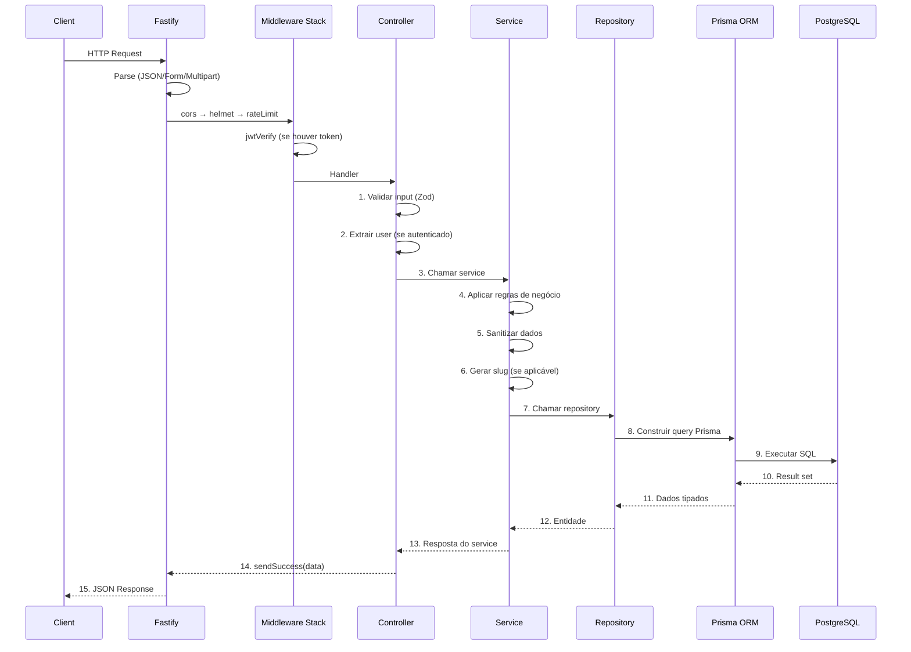

### Etapas Detalhadas

| Etapa | Componente | Responsabilidade |
|---|---|---|
| **1. Parse** | Fastify | Converte body/params/query para objeto |
| **2. CORS** | @fastify/cors | Valida origem da requisição |
| **3. Helmet** | @fastify/helmet | Adiciona headers de segurança |
| **4. Rate Limit** | @fastify/rate-limit | Previne abuso (100 req/min) |
| **5. Auth** | auth.middleware | Verifica JWT, popula `request.user` |
| **6. Validação** | Controller | Zod schema validation |
| **7. Regras** | Service | Lógica de negócio, sanitização |
| **8. Dados** | Repository | Query Prisma, isolamento ORM |
| **9. Resposta** | Controller | Formata e retorna JSON |

---

## 7. Fluxo de Autenticação

### JWT — JSON Web Token

O sistema utiliza **dois tokens**:

| Token | Localização | Duração | Propósito |
|---|---|---|---|
| **Access Token** | Header `Authorization: Bearer <token>` | 15 minutos | Autenticar requisições |
| **Refresh Token** | Cookie httpOnly | 7 dias | Renovar access token |

### Payload do Access Token

```json
{
  "sub": "uuid-do-usuario",
  "email": "usuario@email.com",
  "role": "EDITOR",
  "portal_id": "uuid-do-portal",
  "iat": 1700000000,
  "exp": 1700000900
}
```

### Rotação de Refresh Tokens

Cada renovação de access token:
1. Valida o refresh token atual
2. Revoga o refresh token usado (blacklist)
3. Gera NOVO refresh token
4. Retorna novo access + refresh

Isso previne **replay attacks**: se um refresh token for roubado, ao ser usado o legítimo dono terá seu token revogado.

### RBAC — Matriz de Permissões

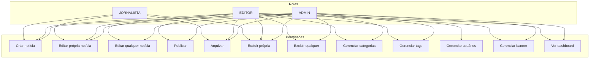

---

## 8. Fluxo de Upload

### Por que upload direto?

A abordagem tradicional (browser → servidor → cloud) tem problemas:

1. **Gargalo** — o servidor precisa receber o arquivo inteiro antes de enviar
2. **Custo** — bandwidth duplicado (entrada + saída)
3. **Memória** — arquivos grandes consomem RAM do servidor
4. **Disponibilidade** — se o servidor cai, upload quebra

### Solução: Presigned URL

```
Browser ──PUT──► Cloudflare R2
    │                  ▲
    ├── POST /upload ──┘ (gera URL assinada)
    │
    ▼
Backend (só coordena, nunca toca no arquivo)
```

### Vantagens

| Aspecto | Upload direto (presigned) | Upload tradicional |
|---|---|---|
| **Performance** | O(n) — 1 transferência | O(2n) — 2 transferências |
| **Uso CPU** | Zero no servidor | Processa multipart |
| **Memória** | Zero | Arquivo inteiro em RAM |
| **Latência** | Menor (CDN) | Maior (2 hops) |
| **Custo bandwidth** | 1× (R2 → usuário) | 2× (servidor + R2) |

---

## 9. Banco de Dados

### Diagrama ER

```mermaid
erDiagram
    Portal ||--o{ User : "1:N"
    Portal ||--o{ News : "1:N"
    Portal ||--o{ Category : "1:N"
    Portal ||--o{ Tag : "1:N"
    Portal ||--o{ Image : "1:N"
    Portal ||--o{ Banner : "1:N"

    User ||--o{ News : "1:N (author)"
    User ||--o{ Image : "1:N (uploader)"
    User ||--o{ Session : "1:N"
    User ||--o{ RefreshToken : "1:N"
    User ||--|| Role : "N:1"

    Role ||--o{ User : "1:N"

    Category ||--o{ News : "1:N"
    Category ||--o{ Category : "1:N (self-ref)"

    News ||--o{ NewsTag : "1:N"
    Tag ||--o{ NewsTag : "1:N"

    Portal {
        uuid id PK
        string name UK
        string slug UK
        string domain "nullable"
        string logo "nullable"
        text description "nullable"
        boolean active
        datetime created_at
        datetime updated_at
    }

    User {
        uuid id PK
        string email UK
        string password
        string name
        string avatar "nullable"
        uuid role_id FK
        uuid portal_id FK
        boolean active
        datetime last_login_at "nullable"
        datetime created_at
        datetime updated_at
    }

    Role {
        uuid id PK
        string name UK "ADMIN|EDITOR|JOURNALIST"
        text description "nullable"
        json permissions "nullable"
        datetime created_at
        datetime updated_at
    }

    News {
        uuid id PK
        string title
        string slug "UK com portal_id"
        string excerpt "nullable"
        text content
        string cover_image "nullable|legado"
        string cover_image_key "nullable"
        string cover_image_alt "nullable"
        enum status "DRAFT|PUBLISHED|ARCHIVED"
        datetime published_at "nullable"
        uuid author_id FK
        uuid category_id FK
        uuid portal_id FK
        int views "default 0"
        string seo_title "nullable"
        string seo_description "nullable"
        string seo_keywords "nullable"
        string og_image "nullable"
        string canonical_url "nullable"
        boolean is_featured
        boolean is_breaking
        datetime created_at
        datetime updated_at

        index slug, portal_id
        index status, published_at
        index is_featured, is_breaking
    }

    Category {
        uuid id PK
        string name
        string slug "UK com portal_id"
        string description "nullable"
        uuid parent_id FK "nullable|self-ref"
        uuid portal_id FK
        int order
        boolean active
        datetime created_at
        datetime updated_at
    }

    Tag {
        uuid id PK
        string name
        string slug "UK com portal_id"
        uuid portal_id FK
        datetime created_at
        datetime updated_at
    }

    Image {
        uuid id PK
        string url
        string key UK "path no storage"
        string thumbnail_url "nullable"
        string alt "nullable"
        string caption "nullable"
        int size
        string mime_type
        int width "nullable"
        int height "nullable"
        uuid uploaded_by FK "nullable"
        uuid portal_id FK
        datetime created_at
    }

    Banner {
        uuid id PK
        string image_key
        string image_url
        string alt "nullable"
        string link_url "nullable"
        boolean active
        int clicks "default 0"
        uuid portal_id FK
        datetime created_at
        datetime updated_at
    }

    Session {
        uuid id PK
        uuid user_id FK
        string token UK
        datetime expires_at
        string ip_address "nullable"
        string user_agent "nullable"
        datetime created_at
    }

    RefreshToken {
        uuid id PK
        uuid user_id FK
        string token UK
        datetime expires_at
        boolean revoked
        datetime created_at
    }
```

### Índices Importantes

```sql
-- News: busca por slug + portal
CREATE UNIQUE INDEX idx_news_slug_portal ON news(slug, portal_id);

-- News: listagem pública
CREATE INDEX idx_news_status_published ON news(status, published_at DESC);

-- News: featured + breaking
CREATE INDEX idx_news_featured ON news(portal_id, is_featured) WHERE is_featured = true;
CREATE INDEX idx_news_breaking  ON news(portal_id, is_breaking) WHERE is_breaking = true;

-- Images: consulta por portal
CREATE INDEX idx_images_portal ON images(portal_id, created_at DESC);

-- FK performance
CREATE INDEX idx_news_author   ON news(author_id);
CREATE INDEX idx_news_category ON news(category_id);
CREATE INDEX idx_user_portal   ON users(portal_id);
CREATE INDEX idx_user_role     ON users(role_id);
```

---

## 10. Regras de Negócio

### Notícias

| Regra | Descrição | Onde |
|---|---|---|
| Slug único | `[slug, portalId]` é único | Prisma + Service |
| Conteúdo mínimo | Mínimo 50 caracteres de texto | Schema + Service |
| Sanitização | HTML sanitizado (XSS) | Service |
| Autoria | Jornalista só edita próprias | Service |
| Publicação | Só EDITOR/ADMIN publicam | Service |
| Views increment | +1 em acesso público | Controller |
| Cover image | Aceita key e URL legada | Service |
| SEO fields | título, descrição, keywords opcionais | Schema |
| Tags | Máximo 10 tags por notícia | Schema |

### Categorias

| Regra | Descrição |
|---|---|
| Slug único | `[slug, portalId]` |
| Hierarquia | Suporte a subcategorias via `parentId` |
| Ativo/inativo | Categorias inativas não aparecem no público |

### Upload

| Regra | Descrição |
|---|---|
| Formatos | JPEG, PNG, WebP, GIF |
| Tamanho | Máximo 10 MB |
| Key única | `{tipo}/{ano}/{mes}/{uuid}.{ext}` |
| Preview | URL pública retornada imediatamente |

### Banner

| Regra | Descrição |
|---|---|
| Um por portal | Apenas 1 banner ativo |
| Delete em cascata | Remove do banco E do R2 |
| Cliques | Contador persistido |

---

## 11. Permissões (RBAC)

### Matriz Completa

| Ação | ADMIN | EDITOR | JOURNALIST | Visitante |
|---|---|---|---|---|
| Ver site público | ✅ | ✅ | ✅ | ✅ |
| Ler notícias | ✅ | ✅ | ✅ | ✅ |
| Criar notícia (rascunho) | ✅ | ✅ | ✅ | ❌ |
| Editar própria notícia | ✅ | ✅ | ✅ | ❌ |
| Editar qualquer notícia | ✅ | ✅ | ❌ | ❌ |
| Publicar notícia | ✅ | ✅ | ❌ | ❌ |
| Arquivar | ✅ | ✅ | ✅ (própria) | ❌ |
| Excluir própria (não publicada) | ✅ | ✅ | ✅ | ❌ |
| Excluir qualquer | ✅ | ✅ | ❌ | ❌ |
| Gerenciar categorias | ✅ | ✅ | ❌ | ❌ |
| Gerenciar tags | ✅ | ✅ | ✅ | ❌ |
| Gerenciar usuários | ✅ | ❌ | ❌ | ❌ |
| Gerenciar banner | ✅ | ✅ | ❌ | ❌ |
| Ver dashboard | ✅ | ✅ | ❌ | ❌ |
| Upload imagens | ✅ | ✅ | ✅ | ❌ |
| Ver uploads | ✅ | ✅ | ✅ | ❌ |

---

## 12. Workflow Editorial

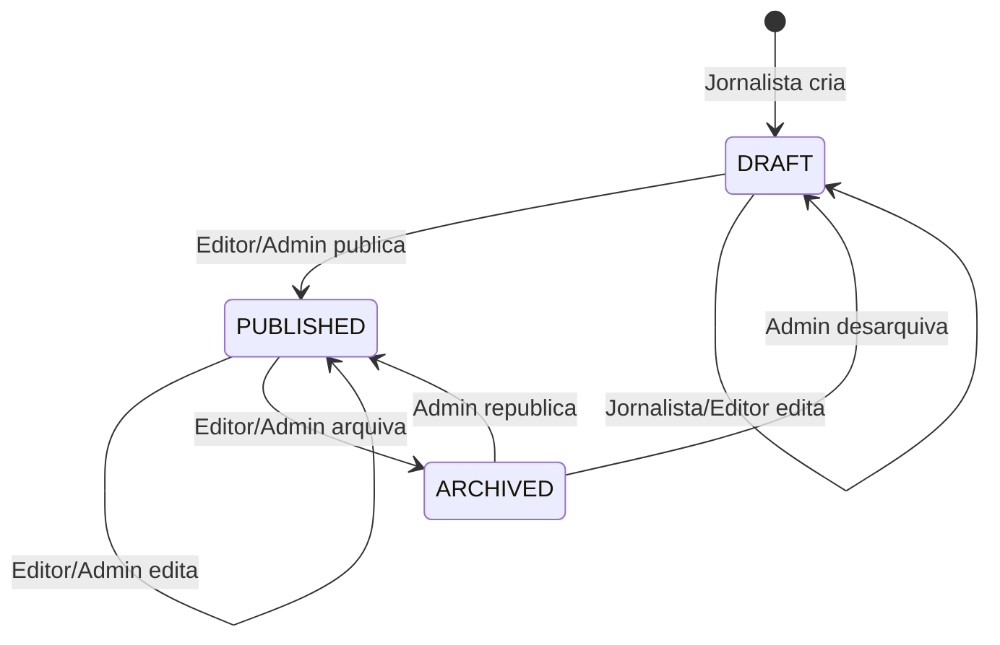

### Transições Permitidas

| De | Para | Quem | Validação |
|---|---|---|---|
| `DRAFT` | `PUBLISHED` | EDITOR, ADMIN | Conteúdo ≥ 50 chars, categoria preenchida |
| `PUBLISHED` | `ARCHIVED` | EDITOR, ADMIN | — |
| `ARCHIVED` | `PUBLISHED` | ADMIN | — |
| `ARCHIVED` | `DRAFT` | ADMIN | — |

### Regras
- Jornalista NÃO publica — precisa de revisão editorial
- Jornalista só arquiva próprias notícias
- Admin pode executar qualquer transição

---

## 13. SEO

### Meta Tags (Server Component)

Cada página de notícia gera dinamicamente:

```html
<title>SEO Title ou Título da Notícia</title>
<meta name="description" content="SEO Description ou Excerpt">
<meta name="keywords" content="palavra1, palavra2">

<!-- Open Graph -->
<meta property="og:title" content="...">
<meta property="og:description" content="...">
<meta property="og:type" content="article">
<meta property="og:image" content="...">
<meta property="og:published_time" content="2026-07-08">
<meta property="article:author" content="Nome do Autor">

<!-- Twitter Card -->
<meta name="twitter:card" content="summary_large_image">
<meta name="twitter:title" content="...">
<meta name="twitter:description" content="...">
<meta name="twitter:image" content="...">

<!-- JSON-LD Structured Data -->
<script type="application/ld+json">
{
  "@context": "https://schema.org",
  "@type": "NewsArticle",
  "headline": "...",
  "description": "...",
  "image": "...",
  "datePublished": "...",
  "author": { "@type": "Person", "name": "..." },
  "publisher": {
    "@type": "Organization",
    "name": "Portal NTB",
    "logo": { "@type": "ImageObject", "url": "/logo.png" }
  }
}
</script>
```

### Sitemap

Gerado dinamicamente em `/sitemap.xml` com:
- Página inicial (prioridade 1.0, hourly)
- Categorias (prioridade 0.8, daily)
- Tags (prioridade 0.5, weekly)
- Notícias publicadas (prioridade 0.8, weekly)

### RSS

Feed completo em `/rss` com as últimas 50 notícias publicadas, incluindo:
- Título, link, descrição
- Data de publicação
- Autor
- Categoria
- GUID único

### Estratégias de Performance SEO

| Técnica | Implementação |
|---|---|
| **SSR** | Server Components com fetch no servidor |
| **ISR** | `revalidate = 3600` (1 hora) para notícias |
| **Lazy Loading** | `loading="lazy"` em imagens de listagem |
| **Priority** | `priority` na imagem principal da notícia |
| **Breadcrumbs** | Schema.org BreadcrumbList |
| **URLs amigáveis** | Slugs em português: `/noticias/titulo-da-noticia` |
| **Canonical** | Link rel="canonical" opcional por notícia |

---

## 14. Multiportal (Multi-Tenancy)

### Estratégia: Row-Level Isolation

O Portal NTB utiliza **discriminação por coluna** (row-level tenant isolation):

- Todas as tabelas de dados possuem `portal_id`
- Consultas SEMPRE filtram por `portal_id`
- Índices compostos incluem `portal_id` para performance
- Usuários pertencem a UM portal e não enxergam dados de outros

### Modelo

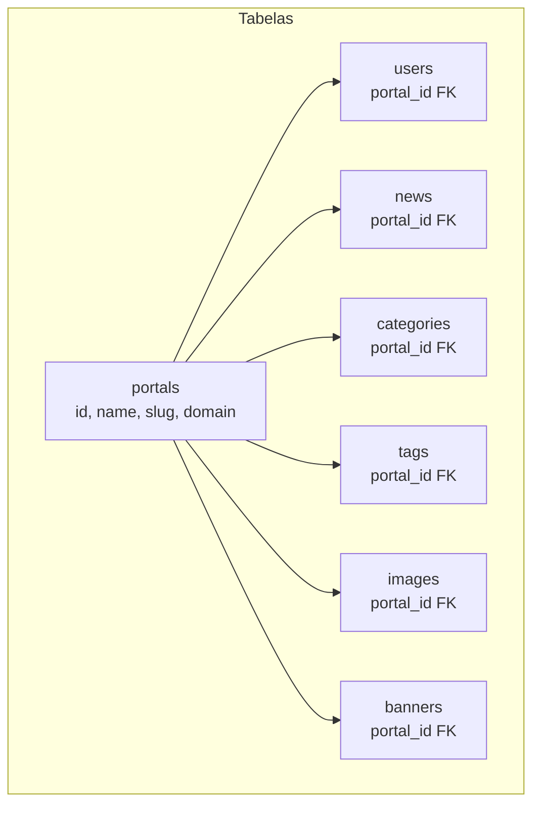

### Isolamento

| Recurso | Isolado? | Como |
|---|---|---|
| Usuários | ✅ | `WHERE portal_id = X` |
| Notícias | ✅ | `WHERE portal_id = X` |
| Categorias | ✅ | `[slug, portal_id]` unique |
| Tags | ✅ | `[slug, portal_id]` unique |
| Imagens | ✅ | `WHERE portal_id = X` |
| Banner | ✅ | `WHERE portal_id = X` |
| Sessões | ✅ | Vinculadas ao user → portal |
| Configurações | ✅ | Tabela Portal |
| Domínio | ✅ | `domain` na tabela Portal |

### Autenticação

Cada portal tem seus próprios usuários. No login, o JWT inclui `portal_id` no payload, e todas as queries o utilizam para filtrar dados.

### Futuro: Subdomínio por Portal

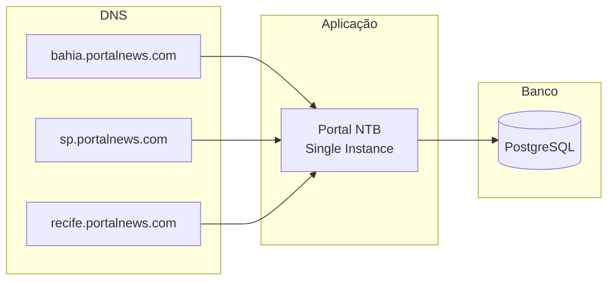

---

## 15. API

### Listar Notícias

```http
GET /api/v1/news?status=PUBLISHED&limit=10&page=1&sort=publishedAt&order=desc
```

**Response:**
```json
{
  "success": true,
  "data": [
    {
      "id": "uuid",
      "title": "Título da Notícia",
      "slug": "titulo-da-noticia",
      "excerpt": "Resumo...",
      "cover_image_key": "news-images/originals/2026/07/uuid.jpg",
      "cover_image_url": "https://pub-xxxx.r2.dev/news-images/originals/2026/07/uuid.jpg",
      "cover_image_alt": "Descrição da imagem",
      "status": "PUBLISHED",
      "published_at": "2026-07-08T10:00:00Z",
      "author": { "id": "uuid", "name": "Autor" },
      "category": { "id": "uuid", "name": "Política", "slug": "politica" },
      "tags": [{ "id": "uuid", "name": "Salvador", "slug": "salvador" }],
      "views": 1234,
      "is_featured": true,
      "is_breaking": false,
      "created_at": "2026-07-08T09:00:00Z"
    }
  ],
  "meta": {
    "page": 1,
    "limit": 10,
    "total": 150,
    "totalPages": 15
  }
}
```

### Criar Notícia

```http
POST /api/v1/news
Authorization: Bearer <token>
Content-Type: application/json

{
  "title": "Título da Notícia",
  "content": "<p>Conteúdo HTML com no mínimo 50 caracteres...</p>",
  "excerpt": "Resumo opcional",
  "cover_image_key": "news-images/originals/2026/07/uuid.jpg",
  "cover_image_alt": "Descrição da imagem",
  "category_id": "uuid-da-categoria",
  "tag_ids": ["uuid-tag-1", "uuid-tag-2"],
  "seo_title": "Título SEO",
  "seo_description": "Descrição SEO",
  "seo_keywords": "palavra1, palavra2",
  "is_featured": false,
  "is_breaking": false
}
```

**Response (201):**
```json
{
  "success": true,
  "data": {
    "id": "uuid",
    "title": "Título da Notícia",
    "slug": "titulo-da-noticia",
    "status": "DRAFT",
    "created_at": "2026-07-08T10:00:00Z"
  }
}
```

### Upload de Imagem

```http
POST /api/v1/upload/presigned
Authorization: Bearer <token>
Content-Type: application/json

{
  "filename": "foto.jpg",
  "contentType": "image/jpeg",
  "size": 102400
}
```

**Response:**
```json
{
  "success": true,
  "data": {
    "uploadUrl": "https://r2-endpoint/bucket/key?X-Amz-Signature=...",
    "key": "news-images/originals/2026/07/uuid.jpg",
    "imageUrl": "https://pub-xxxx.r2.dev/news-images/originals/2026/07/uuid.jpg"
  }
}
```

### Error Response (Validação)

```json
{
  "success": false,
  "error": {
    "code": "VALIDATION_ERROR",
    "message": "Dados inválidos",
    "details": [
      { "field": "title", "message": "Mínimo de 3 caracteres" },
      { "field": "content", "message": "Conteúdo deve ter no mínimo 50 caracteres" }
    ]
  }
}
```

---

## 16. Segurança

### Camadas de Segurança

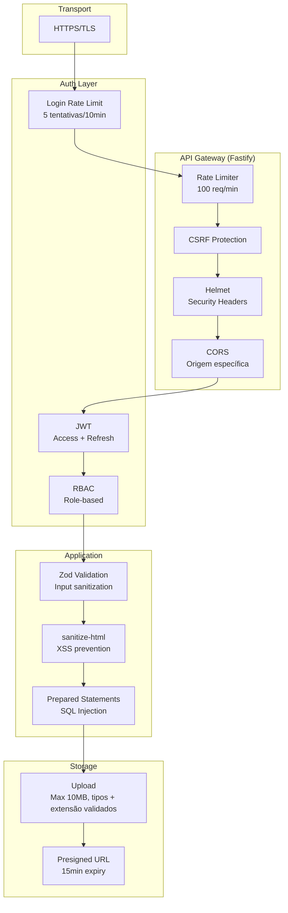

### Medidas Implementadas

| Medida | Onde | Como |
|---|---|---|
| **HTTPS** | Infra | TLS em produção (Nginx configurado) |
| **Rate Limiting** | Fastify | 100 req/min por IP (global) |
| **Login Rate Limit** | Auth | 5 tentativas a cada 10 min por IP |
| **CSRF Protection** | Fastify | @fastify/csrf-protection |
| **Helmet** | Fastify | 15 security headers (CSP, HSTS, X-Frame, etc.) |
| **CORS** | Fastify | Apenas origens permitidas |
| **JWT** | Auth | Access + Refresh com rotação |
| **RBAC** | Middleware | 3 roles com permissões granulares |
| **Zod Validation** | Controller | Schemas em runtime + tipos seguros |
| **XSS Prevention** | Service | sanitize-html no conteúdo |
| **SQL Injection** | Prisma | Prepared statements nativos |
| **Upload seguro** | Schema + Service | Apenas JPEG/PNG/WebP/GIF, max 10MB, extensão validada contra contentType |
| **Presigned URL** | Upload | URL válida 15 minutos |
| **bcrypt** | Auth | 12 rounds de hash |
| **Cookie httpOnly** | Refresh | Não acessível via JS |

---

## 17. Performance

### Estratégias

| Técnica | Onde | Impacto |
|---|---|---|
| **SSR** | Páginas públicas | HTML pronto no primeiro paint |
| **ISR** | Notícias individuais | Revalida a cada 1h, serve estático |
| **React Query** | Admin | Cache client-side, evita refetch |
| **Lazy Loading** | Imagens | `loading="lazy"` em listagens |
| **Priority** | Imagem principal | `priority` na hero |
| **Pagination** | Listagens | 20 itens por página |
| **Database Indexes** | PostgreSQL | Índices compostos nas queries mais comuns |
| **CDN** | Cloudflare R2 | Imagens servidas via CDN global |
| **Compression** | Fastify | Gzip/Brotli automático |

### Métricas Alvo

| Métrica | Alvo |
|---|---|
| **LCP** (Largest Contentful Paint) | < 2.5s |
| **FID** (First Input Delay) | < 100ms |
| **CLS** (Cumulative Layout Shift) | < 0.1 |
| **TTFB** (Time to First Byte) | < 200ms (cache hit) |
| **API Response** (p95) | < 100ms |

---

## 18. Escalabilidade

### Estágios de Escala

| Estágio | Usuários | Estratégia |
|---|---|---|
| **v1 (atual)** | Até 10k | Single instance, Docker Compose |
| **v2** | Até 100k | Horizontal scaling do backend, load balancer |
| **v3** | Até 1M | Redis cache, filas, workers, multi-region |

### v2 — 100 mil usuários

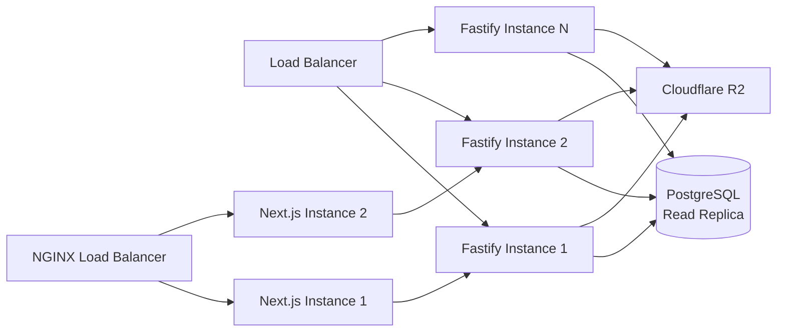

### v3 — 1 milhão de usuários

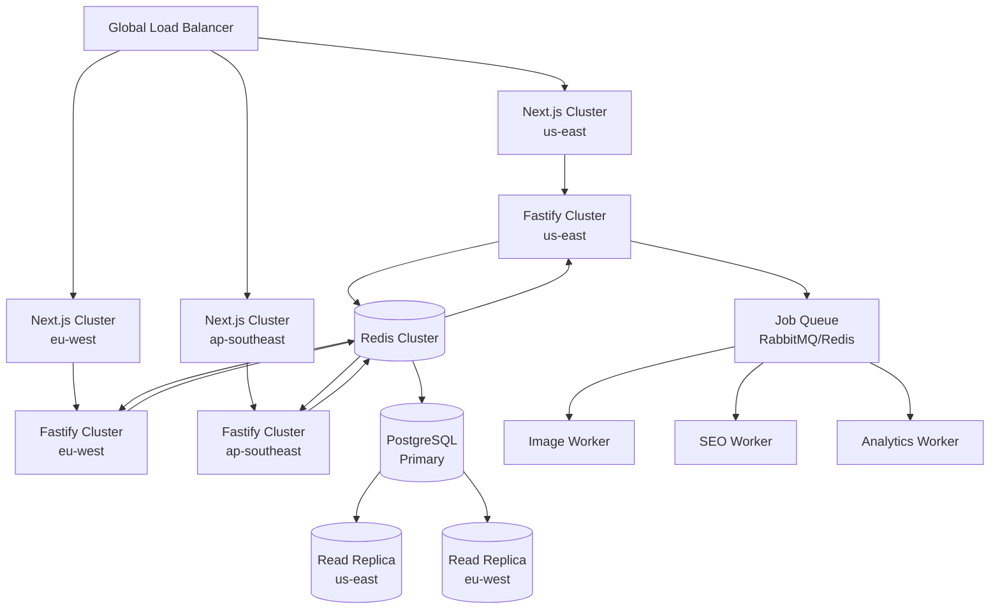

---

## 19. Convenções

### Nomenclatura

| Contexto | Padrão | Exemplo |
|---|---|---|
| **Arquivos** | kebab-case | `news.service.ts`, `auth.middleware.ts` |
| **Pastas** | kebab-case | `services/storage/` |
| **Classes** | PascalCase | `StorageProvider`, `NewsService` |
| **Interfaces** | PascalCase com prefixo I | `INewsRepository` |
| **Funções** | camelCase | `generateSlug()`, `sanitizeContent()` |
| **Variáveis** | camelCase | `coverImageKey`, `publishedAt` |
| **Constantes** | UPPER_SNAKE_CASE | `MAX_FILE_SIZE`, `STORAGE_PATHS` |
| **Schemas Zod** | camelCase com sufixo Schema | `createNewsSchema` |
| **Banco (colunas)** | snake_case | `cover_image_key`, `published_at` |
| **Banco (tabelas)** | snake_case plural | `news_tags`, `refresh_tokens` |

### Commits

```bash
feat: adicionar banner de anúncio 728x90
fix: corrigir CORS no upload de imagens
refactor: extrair StorageProvider para classe própria
docs: atualizar README com endpoints de banner
chore: atualizar dependências
```

### Git Flow

```
main         → produção
├── develop  → desenvolvimento
│   ├── feat/banner-module
│   ├── fix/upload-cors
│   └── refactor/storage-provider
```

---

## 20. Boas Práticas

### Adotadas no Projeto

| Prática | Onde | Por que |
|---|---|---|
| **DRY** (Don't Repeat Yourself) | Services + Repositories | Lógica de negócio centralizada |
| **KISS** (Keep It Simple) | Controllers finos | Cada camada faz só o que precisa |
| **Single Responsibility** | Cada arquivo tem um propósito | Classes pequenas e focadas |
| **Dependency Injection** | Construtores com defaults | Testabilidade + flexibilidade |
| **Interface Segregation** | I*Repository | Mínimo necessário por consumer |
| **Type Safety** | TypeScript + Zod | Erros em compile-time |
| **Defensive Programming** | Validação em todas as camadas | Nunca confie no input |
| **Fail Fast** | Zod no início do request | Erro antes de processar |
| **Principle of Least Privilege** | RBAC | Cada um só faz o que precisa |
| **Separation of Concerns** | Front/Back | API desacoplada |

### Recomendadas (futuro)

| Prática | Impacto |
|---|---|
| **Testes unitários** (Vitest) | Confiança em refatorações |
| **Testes de integração** | Valida fluxo completo |
| **CI/CD** (GitHub Actions) | Deploy automático |
| **Linting** (ESLint + Prettier) | Consistência de código |
| **Husky + lint-staged** | Qualidade no commit |
| **OpenAPI/Swagger** | Documentação viva |
| **Health checks** | Monitoramento |
| **Structured logging** | Debug em produção |
| **Sentry/APM** | Erros em tempo real |

---

## 21. Roadmap

### v1.0.0 (Atual) — MVP

- ✅ CRUD de notícias com editor TipTap
- ✅ Gerenciamento de categorias e tags
- ✅ Upload de imagens via presigned URL (R2)
- ✅ Banner de anúncio 728x90
- ✅ Autenticação JWT + Refresh Token
- ✅ RBAC (Admin, Editor, Jornalista)
- ✅ SEO (Open Graph, JSON-LD, sitemap, RSS)
- ✅ Multi-tenant por discriminação de coluna
- ✅ Docker Compose para desenvolvimento
- ✅ Galeria de imagens
- ✅ ISR para páginas públicas

### v1.1.0 — Melhorias

- 🔲 Comentários em notícias (moderados)
- 🔲 Newsletter por portal (Mailchimp/SendGrid)
- 🔲 Notificações push para breaking news
- 🔲 Modo escuro no admin
- 🔲 Exportar notícias para PDF
- 🔲 Histórico de versões (cada edição vira uma versão)
- 🔲 Preview de notícia antes de publicar

### v2.0.0 — SaaS

- 🔲 Múltiplos portais com subdomínio (portal1.app.com, portal2.app.com)
- 🔲 Onboarding auto-serviço (sign up do portal)
- 🔲 Planos de billing (Stripe)
- 🔲 Temas customizáveis por portal
- 🔲 Analytics por portal (Google Analytics nativo)
- 🔲 Redis para cache de queries
- 🔲 Filas de jobs para tarefas pesadas (geração de thumbnails)
- 🔲 Testes E2E (Playwright)

### v3.0.0 — Enterprise

- 🔲 Leitura de artigos com paywall (integração Stripe)
- 🔲 Equipe multi-redação por portal
- 🔲 Área de membros (assinantes)
- 🔲 Aplicativo mobile (React Native)
- 🔲 Plugin de anúncios (Google Ad Manager)
- 🔲 IA para sugestão de tags, resumo automático
- 🔲 Multi-idioma
- 🔲 CDN multi-região
- 🔲 Dashboard em tempo real

---

## 22. Decisões Arquiteturais (ADR)

### ADR-001: Fastify vs Express

**Contexto:** Escolha do framework HTTP para o backend.

**Decisão:** Fastify 5.

**Vantagens:**
- 2× mais throughput que Express (35k vs 15k req/s)
- Validação nativa de schemas (JSON Schema)
- Plugin system maduro (CORS, Helmet, JWT, Rate Limit)
- Logger integrado (Pino)
- Suporte nativo a TypeScript

**Desvantagens:**
- Ecossistema menor que Express
- Menos exemplos e tutoriais

**Alternativas consideradas:** Express (ecossistema grande, mas mais lento e verboso), Hono (Edge-ready, mas ainda imaturo).

---

### ADR-002: Prisma vs TypeORM vs Drizzle

**Contexto:** Escolha do ORM.

**Decisão:** Prisma 6.

**Vantagens:**
- Type-safety de fábrica (tipos inferidos do schema)
- Migrations automáticas e seguras
- Prisma Studio para inspeção visual
- Schema declarativo (fonte da verdade)
- Performance próxima de SQL puro

**Desvantagens:**
- Cold start mais lento (geração de client)
- Queries complexas podem exigir SQL raw
- Consumo de memória maior que Drizzle

**Alternativas consideradas:** TypeORM (decorators confusos, migrações frágeis), Drizzle (leve e rápido, mas ecossistema menor).

---

### ADR-003: Next.js vs Remix vs Vite SPA

**Contexto:** Escolha do framework frontend.

**Decisão:** Next.js 16 com App Router.

**Vantagens:**
- SSR/ISR/SSG — melhor SEO que SPA
- Server Components (menos JS no cliente)
- Image Optimization nativa
- App Router (layouts aninhados, loading states)
- Ecossistema e comunidade enormes

**Desvantagens:**
- Complexidade maior que SPA
- Bundle size maior que um React puro
- Server Components exigem mudança de mentalidade

**Alternativas consideradas:** Remix (bom, mas ecossistema menor), Vite + React Router (SPA puro — SEO sofre).

---

### ADR-004: Presigned Upload vs Server-Side Upload

**Contexto:** Como enviar imagens para o storage.

**Decisão:** Presigned URL (upload direto browser → R2).

**Vantagens:**
- O arquivo nunca passa pelo servidor (zero CPU/memória)
- Latência reduzida em 50% (1 hop vs 2 hops)
- Escalabilidade infinita (o R2 recebe o arquivo)
- Custo de bandwidth reduzido pela metade

**Desvantagens:**
- Requer CORS configurado no bucket
- Complexidade ligeiramente maior que upload simples
- URL expira em 15 minutos

**Alternativas consideradas:** Upload server-side (mais simples, mas dobra custo e latência), Upload via API Gateway (mais caro).

---

### ADR-005: JWT + Refresh Token vs Sessions

**Contexto:** Estratégia de autenticação.

**Decisão:** JWT com access + refresh token.

**Vantagens:**
- Stateless (access token) — sem consulta ao banco
- Refresh token com rotação — segurança
- Token armazenado em cookie httpOnly — protege contra XSS
- Escalabilidade horizontal sem shared session store

**Desvantagens:**
- Logout requer blacklist de refresh tokens
- Access token não é revogável até expirar (15 min)
- Tamanho do token (pode pesar em requests)

**Alternativas consideradas:** Sessions (server-side state — requer Redis para escalar), OAuth2 (overkill para CMS).

---

### ADR-006: Cloudflare R2 vs S3 vs MinIO

**Contexto:** Storage de imagens.

**Decisão:** Cloudflare R2.

**Vantagens:**
- Zero custo de egress (S3 cobra saída)
- CDN global integrada
- API compatível com S3
- Cache integrado

**Desvantagens:**
- Menos regiões que AWS
- Sem algumas features avançadas do S3 (Glacier, etc.)

**Alternativas consideradas:** AWS S3 (custo de egress alto), MinIO (auto-gerenciado, mais trabalho operacional), DigitalOcean Spaces (bom mas menos recursos).

---

### ADR-007: Repository Pattern vs Acesso Direto ao Prisma

**Contexto:** Como acessar dados.

**Decisão:** Repository Pattern com interfaces.

**Vantagens:**
- Isolamento do ORM — trocar Prisma por outro ORM não impacta services
- Testabilidade — mock de repositórios
- Controle fino sobre queries expostas
- Cache pode ser adicionado no repositório

**Desvantagens:**
- Mais código boilerplate
- Abstração sobre abstração (Prisma já abstrai SQL)

**Alternativas consideradas:** Acesso direto ao Prisma (menos código, mas acoplamento forte), Query Objects (mais flexível, mais arquivos).

---

### ADR-008: Zod vs Joi vs Yup

**Contexto:** Validação de schemas.

**Decisão:** Zod.

**Vantagens:**
- Inferência de tipos automática (`z.infer`)
- Composição de schemas
- Mensagens de erro customizáveis
- Melhor integração com TypeScript

**Desvantagens:**
- Ecossistema menor que Joi
- Performance ligeiramente inferior a Joi

**Alternativas consideradas:** Joi (bom mas sem inferência de tipos), Yup (menos tipos), JSON Schema (verboso).

---

## 23. Começando

### Pré-requisitos

- Docker e Docker Compose
- Cloudflare R2 bucket configurado (opcional em dev)

### Desenvolvimento

```bash
# 1. Clone
git clone https://github.com/seu-usuario/portal-news.git
cd portal-news

# 2. Configure variáveis de ambiente
cp backend/.env.example backend/.env
# Edite backend/.env com suas credenciais

# 3. Suba os containers
docker compose up -d

# 4. Aplique migrations e seed
docker compose exec backend npx prisma migrate deploy
docker compose exec backend npx prisma db seed

# 5. Acesse
open http://localhost:3000  # Frontend
open http://localhost:3001/docs  # Swagger
```

### Credenciais de Teste

| Papel | Email | Senha (dev) |
|---|---|---|
| **Admin** | admin@portal.com | Definida via `SEED_PASSWORD` no `.env` |
| **Editor** | editor@portal.com | Definida via `SEED_PASSWORD` no `.env` |
| **Jornalista** | jornalista@portal.com | Definida via `SEED_PASSWORD` no `.env` |
| **Jornalista** | marina@portal.com | Definida via `SEED_PASSWORD` no `.env` |

> ⚠️ Em desenvolvimento, se `SEED_PASSWORD` não for definida, a senha padrão é `temp-admin-change-me-please`. Altere no `.env` ou configure uma senha forte em produção.

### Comandos Úteis

```bash
# Logs
docker compose logs -f backend
docker compose logs -f frontend

# Rebuild
docker compose up -d --build backend

# Prisma Studio (inspecionar banco)
docker compose exec backend npx prisma studio

# Reset completo (destrói dados + recria)
docker compose exec backend npx prisma migrate reset --force

# Compilar TypeScript no container
docker compose exec backend npx tsc

# Regenerar Prisma Client
docker compose exec backend npx prisma generate
```

---

## 24. Contribuição

### Como Contribuir

1. Fork o repositório
2. Crie uma branch: `git checkout -b feat/minha-feature`
3. Commit suas mudanças: `git commit -m "feat: descrição"`
4. Push: `git push origin feat/minha-feature`
5. Abra um Pull Request

### Guia de Estilo

- Siga as [convenções](#19-convenções) do projeto
- Mantenha a cobertura de tipos TypeScript
- Prefira composição a herança
- Nomes descritivos > comentários
- Teste antes de abrir PR

---

## 📄 Licença

MIT © 2026 Portal NTB

---

<p align="center">
  <sub>Feito com ❤️ para jornalismo independente e tecnologia</sub>
</p>
