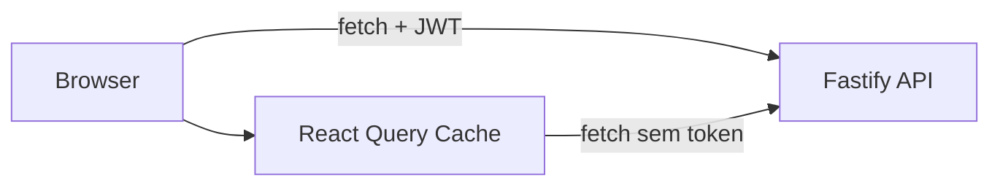

# Frontend — CMS Portal NTB

Frontend em Next.js 16 + React 19 para CMS de notícias multiportal.

## Stack

| Tecnologia | Versão | Uso |
|---|---|---|
| **Next.js** | 16.x | Framework (App Router, SSR, ISR) |
| **React** | 19.x | UI (Server + Client Components) |
| **TypeScript** | 5.x | Tipagem |
| **Tailwind CSS** | v4 | Estilização utility-first |
| **TanStack Query** | 5.x | Server state / cache |
| **React Hook Form** | 7.x | Formulários |
| **TipTap** | 3.x | Editor rich-text (ProseMirror) |
| **Framer Motion** | 12.x | Animações |
| **Lucide React** | — | Ícones |
| **Zod** | 4.x | Validação |
| **date-fns** | 4.x | Datas (locale pt-BR) |
| **DOMPurify** | 3.x | Sanitização XSS (cliente) |
| **Radix UI** | — | Componentes headless acessíveis |
| **shadcn/ui** | — | Componentes de UI |

## Primeiros passos

```bash
# Instalar dependências
npm install

# Copiar variáveis de ambiente
cp .env.example .env  # e preencher

# Iniciar desenvolvimento
npm run dev
```

Acessar em `http://localhost:3000`.

## Estrutura

```
src/
├── app/
│   ├── (public)/              # Site público (SSR + ISR)
│   │   ├── page.tsx           # Homepage
│   │   ├── layout.tsx         # Layout público (Header + Footer)
│   │   ├── hero-section.tsx   # Seção hero com Framer Motion
│   │   ├── noticias/[slug]/   # Página de notícia
│   │   ├── categorias/[slug]/ # Listagem por categoria
│   │   ├── tags/[slug]/       # Listagem por tag
│   │   ├── busca/             # Página de busca
│   │   ├── rss/route.ts       # Feed RSS
│   │   └── sitemap.xml/route.ts
│   ├── (admin)/               # Painel administrativo (protegido)
│   │   ├── layout.tsx         # AdminLayout com sidebar
│   │   ├── dashboard/
│   │   ├── noticias/          # Listagem, novo, editar
│   │   ├── categorias/
│   │   ├── tags/
│   │   ├── usuarios/
│   │   ├── uploads/           # Galeria com ImageDetailModal
│   │   ├── banner/
│   │   ├── configuracoes/
│   │   └── perfil/
│   ├── login/                 # Página de login
│   ├── layout.tsx             # Root layout (fontes, metadata)
│   ├── providers.tsx          # QueryClient + AuthProvider
│   └── globals.css            # Tailwind v4 + variáveis CSS
├── components/
│   ├── ui/                    # shadcn/ui (20+ componentes)
│   ├── layouts/               # Header, Footer, AdminLayout, HeaderBanner
│   └── news/                  # NewsForm, NewsCard, NewsGrid
├── hooks/                     # React Query hooks
│   ├── useAuth.ts
│   ├── useNews.ts
│   ├── useCategories.ts
│   ├── useTags.ts
│   ├── useUpload.ts
│   ├── useStats.ts
│   └── useConfirmDialog.tsx
├── lib/                       # Utilitários e API client
│   ├── api.ts                 # ApiClient (cliente)
│   ├── api.server.ts          # apiGet (SSR/ISR)
│   ├── auth.tsx               # AuthProvider + useAuth
│   ├── constants.ts           # API_URL, SITE_URL centralizados
│   ├── utils.ts               # cn(), formatDate(), formatDateTime()
│   ├── image.ts               # getImageUrl(), getCoverImageUrl()
│   ├── sanitize.ts            # DOMPurify wrapper
│   └── categories.server.ts   # Categorias no servidor
└── types/
    └── index.ts               # User, NewsItem, Category, Tag, payloads
```

## Páginas Públicas

| Rota | Componente | Cache |
|------|------------|:-----:|
| `/` | Server Component | ISR (60s) |
| `/noticias/[slug]` | Server Component + Client (article) | ISR (3600s) |
| `/categorias/[slug]` | Server Component | ISR (60s) |
| `/tags/[slug]` | Server Component | ISR (60s) |
| `/busca` | Client Component | Dinâmico |
| `/rss` | Route Handler | Dinâmico |
| `/sitemap.xml` | Route Handler | Dinâmico |

## Páginas Admin

| Rota | Descrição |
|------|-----------|
| `/dashboard` | Cards de métricas + notícias recentes |
| `/noticias` | Listagem com DataTable |
| `/noticias/novo` | Formulário com editor TipTap |
| `/noticias/[slug]/edit` | Edição de notícia |
| `/categorias` | CRUD de categorias |
| `/tags` | CRUD de tags |
| `/usuarios` | Gerenciamento (admin apenas) |
| `/uploads` | Galeria de imagens com modal de detalhes |
| `/banner` | Gerenciamento de banner 728x90 |
| `/configuracoes` | Configurações do portal |
| `/perfil` | Perfil do usuário logado |

## Comunicação com API



- **Client Components:** `api.ts` — ApiClient com refresh automático (sessionStorage + cookie httpOnly)
- **Server Components:** `api.server.ts` — apiGet com timeout de 5s, sem autenticação
- **Upload:** Presigned URL — browser → Cloudflare R2 (nunca passa pelo servidor)

## Padrões

### Componentes
- **Server Components** para páginas públicas (SEO, ISR, performance)
- **Client Components** apenas para interatividade (admin, formulários, animações)
- Componentes UI (shadcn/ui) em `components/ui/` — reutilizáveis e estilizados com `cn()`
- Componentes de domínio em suas próprias pastas (`news/`, `layouts/`)

### Data Fetching
- TanStack Query para cache client-side, com `staleTime: 60s`
- Mutations invalidam queries relacionadas automaticamente
- Server Components usam fetch direto com `revalidate` controlado pela página

### Formulários
- React Hook Form + Zod resolver para validação
- TipTap para editor rich-text com toolbar personalizada
- Upload de imagem de capa via presigned URL

### Autenticação
- AuthProvider com contexto global
- Access token em sessionStorage (refreshes automáticos via cookie httpOnly)
- Redirect automático para `/login` se não autenticado

## SEO

Cada página pública gera dinamicamente:
- Meta tags (title, description, keywords)
- Open Graph (og:title, og:description, og:image, og:type)
- Twitter Cards (summary_large_image)
- JSON-LD (NewsArticle schema)
- Breadcrumbs com schema.org

## Performance

| Técnica | Onde |
|---------|------|
| **ISR** | Homepage (60s), notícias (3600s) |
| **React Query** | Admin — cache client-side, evita refetch |
| **Lazy loading** | Imagens em listagens (`loading="lazy"`) |
| **Priority** | Imagem principal da notícia (`priority`) |
| **Server Components** | Zero JavaScript no bundle do cliente |

## Scripts

```bash
npm run dev     # Desenvolvimento (hot reload)
npm run build   # Build de produção
npm run start   # Servir build
npm run lint    # ESLint
```
